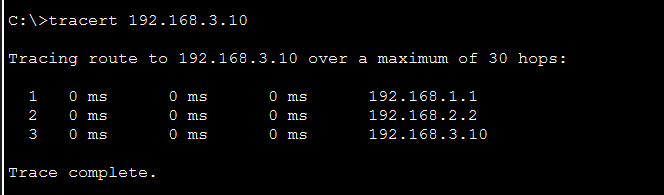
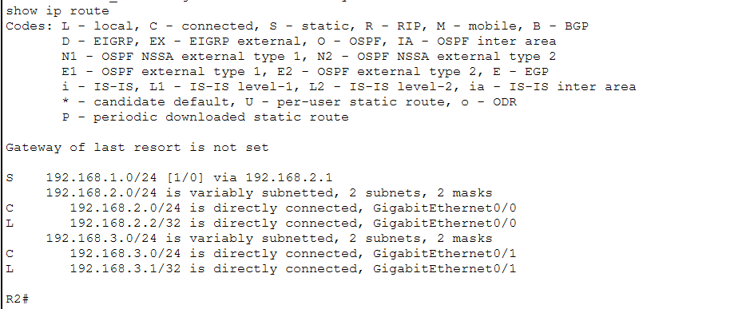
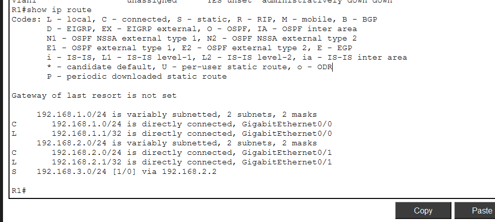

# Packet Tracer Lab 3: Static Routing Between Two Routers

## Overview

Built a multi-router network in Cisco Packet Tracer to practice static route configuration. Two PCs on separate networks communicate through two routers using manually configured static routes.

## Network Topology


```
PC0 (192.168.1.10) → Switch0 → R1 → R2 → Switch1 → PC1 (192.168.3.10)
```

## Addressing Table

| Device | Interface          | IP Address   | Subnet Mask   | Default Gateway |
| ------ | ------------------ | ------------ | ------------- | --------------- |
| PC0    | FastEthernet0      | 192.168.1.10 | 255.255.255.0 | 192.168.1.1     |
| R1     | GigabitEthernet0/0 | 192.168.1.1  | 255.255.255.0 | —               |
| R1     | GigabitEthernet0/1 | 192.168.2.1  | 255.255.255.0 | —               |
| R2     | GigabitEthernet0/0 | 192.168.2.2  | 255.255.255.0 | —               |
| R2     | GigabitEthernet0/1 | 192.168.3.1  | 255.255.255.0 | —               |
| PC1    | FastEthernet0      | 192.168.3.10 | 255.255.255.0 | 192.168.3.1     |

## What I Configured

**Router 1 (R1):**

```
interface GigabitEthernet0/0
 ip address 192.168.1.1 255.255.255.0
 no shutdown

interface GigabitEthernet0/1
 ip address 192.168.2.1 255.255.255.0
 no shutdown

ip route 192.168.3.0 255.255.255.0 192.168.2.2
```

**Router 2 (R2):**

```
interface GigabitEthernet0/0
 ip address 192.168.2.2 255.255.255.0
 no shutdown

interface GigabitEthernet0/1
 ip address 192.168.3.1 255.255.255.0
 no shutdown

ip route 192.168.1.0 255.255.255.0 192.168.2.1
```

## Troubleshooting

After initial configuration, pinging PC1 from PC0 returned **"Destination host unreachable"** from 192.168.2.2 (R2). The packet was reaching R2 but going no further.

**Diagnosis:** Ran `show ip interface brief` on R2 and found that GigabitEthernet0/1 had **no IP address assigned** — it showed "unassigned" even though the interface was physically up.

```
R2#show ip interface brief
GigabitEthernet0/0    192.168.2.2    YES manual    up    up
GigabitEthernet0/1    unassigned     YES unset     up    up
```

**Fix:** Assigned the missing IP address to R2's GigabitEthernet0/1 interface:

```
R2(config)# interface GigabitEthernet0/1
R2(config-if)# ip address 192.168.3.1 255.255.255.0
R2(config-if)# no shutdown
```

After the fix, ping and traceroute both succeeded.

## Verification

### Ping (PC0 → PC1)

```
C:\>ping 192.168.3.10
Reply from 192.168.3.10: bytes=32 time<1ms TTL=126
Reply from 192.168.3.10: bytes=32 time<1ms TTL=126
Reply from 192.168.3.10: bytes=32 time<1ms TTL=126
```

### Traceroute (PC0 → PC1)



```
C:\>tracert 192.168.3.10
1    0 ms    192.168.1.1    (R1 - gateway)
2    0 ms    192.168.2.2    (R2 - next hop via static route)
3    0 ms    192.168.3.10   (PC1 - destination)
```

### Routing Table (R1)



```
C    192.168.1.0/24 is directly connected, GigabitEthernet0/0
C    192.168.2.0/24 is directly connected, GigabitEthernet0/1
S    192.168.3.0/24 [1/0] via 192.168.2.2
```

### Routing Table (R2)



```
S    192.168.1.0/24 [1/0] via 192.168.2.1
C    192.168.2.0/24 is directly connected
C    192.168.3.0/24 is directly connected
```

## Key Takeaways

* Routers only know about directly connected networks automatically (C routes)
* Static routes (S routes) must be configured manually for non-connected networks
* `ip route [destination] [mask] [next-hop]` is the command format
* Always verify interfaces with `show ip interface brief` — an interface can be physically "up" but have no IP assigned
* Troubleshooting approach: ping locally first, then across networks, use `show` commands to find the gap

## Tools Used

* Cisco Packet Tracer
* 2x Cisco 2911 Routers
* 2x Cisco 2960 Switches
* 2x PCs

---

*Lab completed 04/12/2026 | CompTIA A+ & Network+ preparation*
