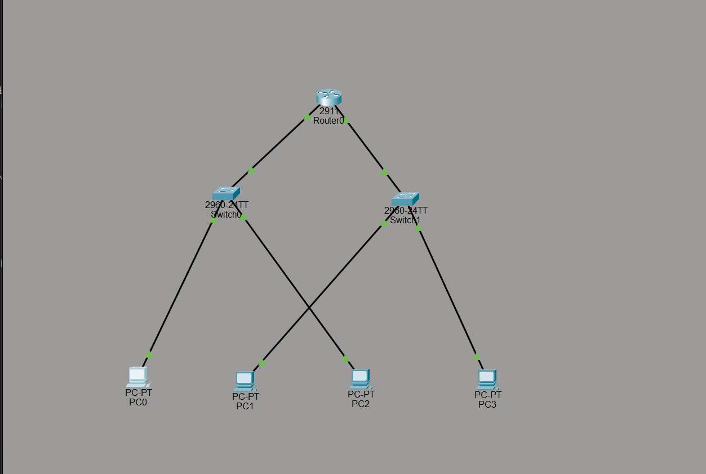
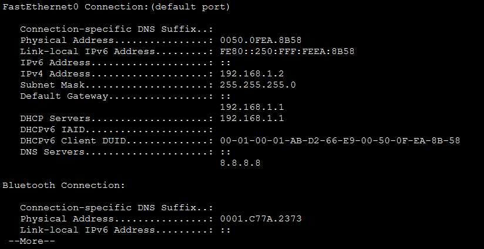
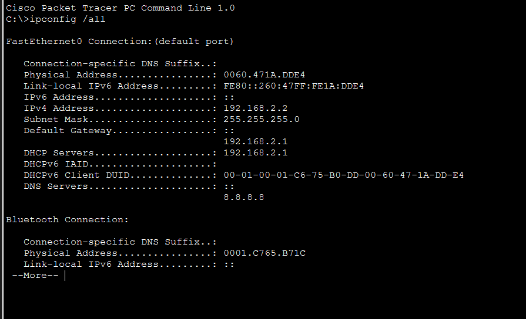
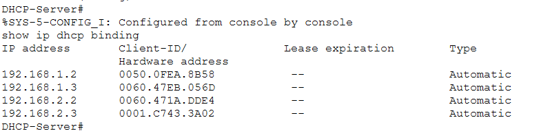

# Lab 4: DHCP Server on a Router — Automatic IP Assignment

No more manually typing IP addresses on every PC. In this lab, the router is configured to automatically assign IP addresses to devices using DHCP, similar to how home and office networks operate.

---

## 🧠 Objective

Configure a Cisco router to act as a DHCP server for two separate LANs, allowing all connected PCs to automatically receive:

- IP address  
- Subnet mask  
- Default gateway  
- DNS server  

---

## 🖧 Topology



PC0 ─→ Switch ─→ Router (DHCP Server) ─→ Switch ─→ PC1  
                    │                        │  
                   PC2                      PC3  

---

## ⚙️ Devices Used

- 1 Router (2911)  
- 2 Switches (2960)  
- 4 PCs  

---

## 🔌 Cabling

- PC0 → Switch0 (straight-through)  
- PC2 → Switch0 (straight-through)  
- Switch0 → Router Gig0/0 (straight-through)  
- Router Gig0/1 → Switch1 (straight-through)  
- PC1 → Switch1 (straight-through)  
- PC3 → Switch1 (straight-through)  

---

## 🛠️ Configuration

### Router Interface Setup

```
enable
config terminal
hostname DHCP-Server

interface GigabitEthernet0/0
 ip address 192.168.1.1 255.255.255.0
 no shutdown
 exit

interface GigabitEthernet0/1
 ip address 192.168.2.1 255.255.255.0
 no shutdown
 exit
```

---

### DHCP Configuration

```
ip dhcp pool LAN1
 network 192.168.1.0 255.255.255.0
 default-router 192.168.1.1
 dns-server 8.8.8.8
 exit

ip dhcp pool LAN2
 network 192.168.2.0 255.255.255.0
 default-router 192.168.2.1
 dns-server 8.8.8.8
 exit
```

---

### Excluded Addresses

```
ip dhcp excluded-address 192.168.1.1
ip dhcp excluded-address 192.168.2.1
```

---

## 💻 PC Configuration

On each PC:

- Desktop → IP Configuration  
- Select **DHCP**  

Each PC will automatically receive an IP address based on its network.

---

## 🔍 Verification

### IP Configuration (DHCP Assigned)





Expected results:
- PCs on left network → 192.168.1.x  
- PCs on right network → 192.168.2.x  

---

### DHCP Bindings on Router



```
show ip dhcp binding
```

Displays all assigned IP addresses and corresponding MAC addresses.

---

### Test Connectivity

From PC0:

```
ping 192.168.2.x
```

Ping should be successful, confirming routing between networks.

---

## 🧠 What I Learned

- DHCP automates IP address assignment across a network  
- ip dhcp pool defines the available address range  
- default-router sets the gateway for clients  
- dns-server provides name resolution  
- ip dhcp excluded-address prevents assigning reserved IPs  
- show ip dhcp binding identifies which device received which IP  

---

## 🎯 Outcome

Successfully configured a router to dynamically assign IP addresses to multiple devices across two separate networks. Verified full connectivity and proper DHCP operation.

---

## 📚 A+ Exam Connection

If a device receives an IP address in the range:

169.254.x.x  

This is an APIPA address, which indicates that the DHCP server is not responding.

---

## 📁 Files

- Lab 4 - DHCP Server on a Router_Automatic IP Assignment.pkt  
- README.md  

---

## 🚀 Next Steps

- VLANs with DHCP  
- DHCP Relay (ip helper-address)  
- NAT configuration  
